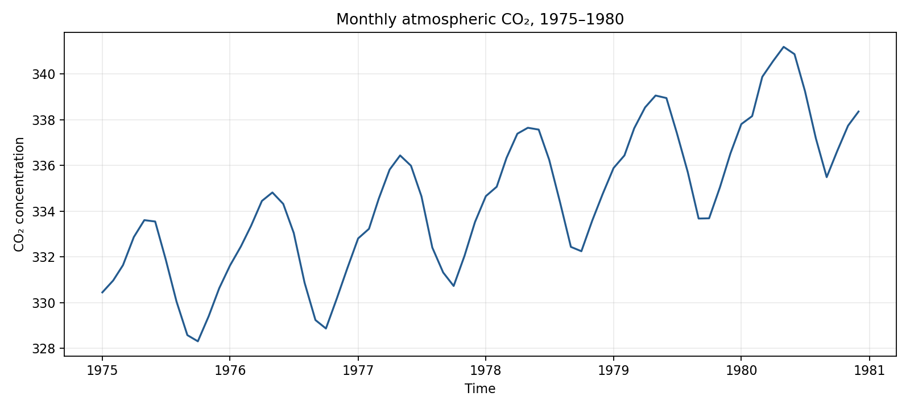
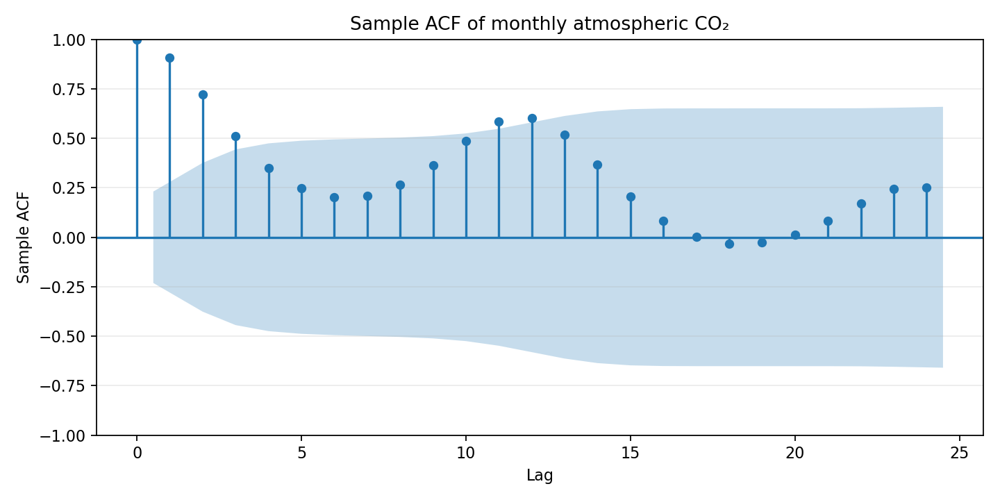
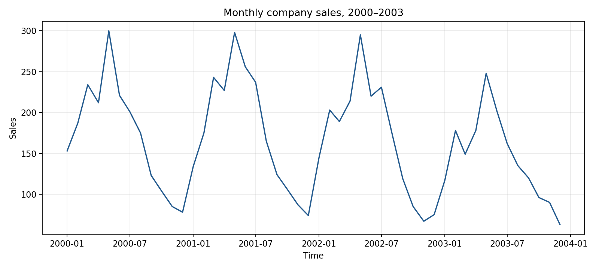
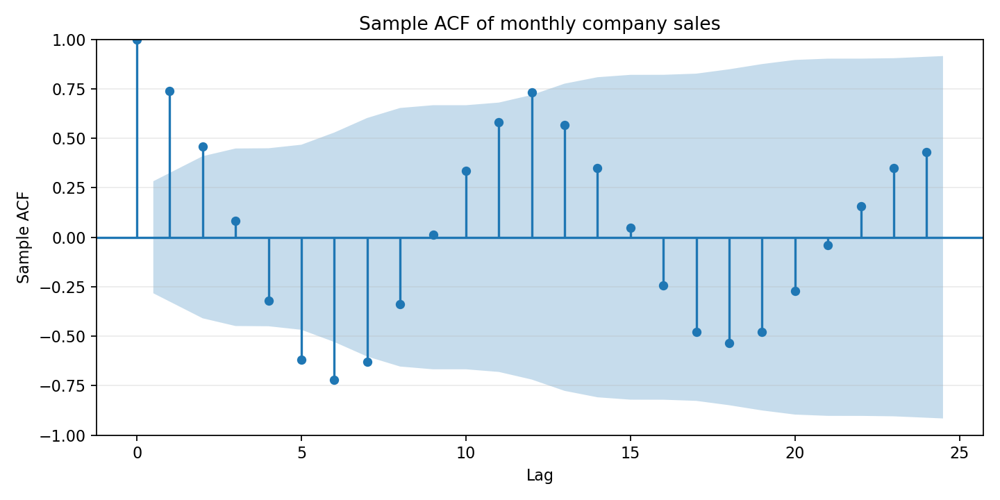

# 实验一：时间序列图检验

运行 `python exp1/analysis.py` 后，程序会读取 `doc/E2_2.xlsx` 和 `doc/E2_5.xlsx`，并在 `figures/` 下生成图表。

## CO₂ 月度序列（1975–1980）

时序图显示浓度整体上升，同时存在重复的年内波动；均值随时间改变，因此该序列不平稳。样本自相关在短滞后处很高，随后缓慢下降，并在约 12 个月附近再次升高，体现出趋势性和年度周期结构。

## 月度销售量（2000–2003）

时序图呈现明显的年内起伏，且后期水平与前期不同；样本自相关呈现约 12 个月的周期性变化。因此按图检验，该序列不满足均值和相关结构稳定的平稳序列特征。

Ljung–Box 检验取 10 阶滞后，统计量为 132.982，p 值为 1.15×10⁻²³。在 5% 显著性水平下拒绝“前 10 阶自相关均为零”的原假设，销售量序列不是纯随机序列。

