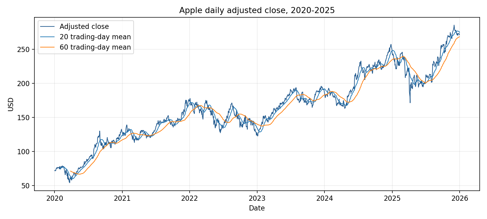
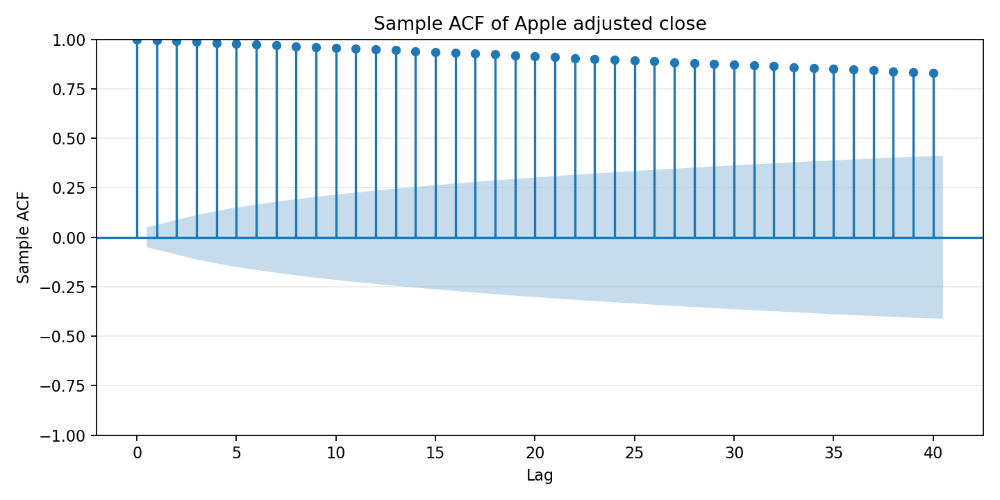
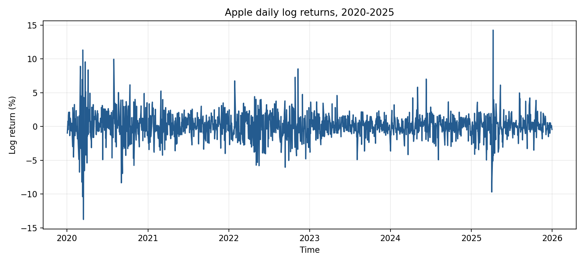
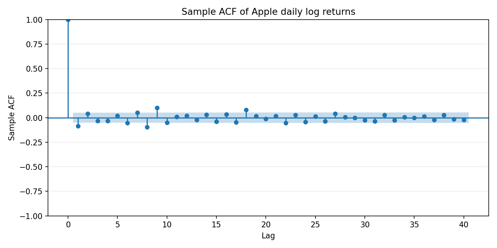

# 实验一 时间序列预处理

在同一个 `analysis.py` 中完成 Apple 股价探索、CO₂ 月度序列图检验、月度销售量图检验与纯随机性检验。报告结论与 `results.json` 一致。

## 运行方式

优先使用本机已有的 Anaconda 环境。从仓库根目录执行 `python exp1/analysis.py`，也可进入 `exp1/` 后执行 `python analysis.py`。如需补齐依赖，使用南京大学镜像：

```powershell
python -m pip install -r exp1/requirements.txt -i https://mirrors.nju.edu.cn/pypi/web/simple
```

默认读取 `doc/` 中保存的数据，生成 `figures/` 下的八张图和 `results.json`，无需联网。只有 Apple 数据快照不存在，或执行 `python exp1/analysis.py --refresh-apple` 时，才从 Yahoo Finance 下载股价。复权价可能因后续分红调整；使用提交的快照可复现本次结果。

## 数据与生成文件

| 文件 | 内容 |
| --- | --- |
| `doc/E2_2.xlsx` | 1975—1980 年 CO₂ 月度数据，72 个观测 |
| `doc/E2_5.xlsx` | 2000—2003 年月度销售量，48 个观测 |
| `doc/AAPL_2020_2025.csv` | 2020-01-02 至 2025-12-31 的 Apple 日度 OHLC、复权收盘价和成交量，1,508 个交易日 |
| `doc/AAPL_2020_2025_source.json` | 来源、下载时间、复权口径与快照 SHA-256 |
| `doc/AAPL_monthly_close.csv` | 由日度复权收盘价提取的 72 个月末收盘价 |
| `figures/` | Apple 四张图、CO₂ 两张图、销售量两张图 |
| `results.json` | 描述统计、自相关、ADF 与 Ljung–Box 检验结果 |
| `fill_report.py` | 用本地原始 Word 模板和分析结果补全报告 |

三组数据均无缺失值。Apple 日期无重复，非交易日不补值；CO₂ 与销售量使用原始月度数据。

## Apple 公司股价探索

数据来自 [Yahoo Finance AAPL 历史行情](https://finance.yahoo.com/quote/AAPL/history/)。分析使用 `Adj Close`，单位为美元，按照数据源口径进行了拆股和分红复权；`Close` 列仅做拆股调整。

复权收盘价从 72.27 美元变为 271.12 美元，区间最低为 54.12 美元（2020-03-23），最高为 285.41 美元（2025-12-02）。价格图中的 20 日与 60 日移动平均随时间改变，自相关缓慢衰减。含常数项、以 AIC 选择滞后阶数的 ADF 检验得到统计量 −0.919、p 值 0.7816，在 5% 水平下未拒绝单位根假设；结合图形判断，价格表现出非平稳特征。





日对数收益率定义为 `100 × ln(Pt / Pt−1)`，共 1,507 个观测，均值为 0.0877%，样本标准差为 1.9994%。ADF 统计量为 −13.005，p 值为 2.63×10⁻²⁴，拒绝单位根假设。

收益率 Ljung–Box 检验取 10 阶滞后，统计量为 58.955，p 值为 5.71×10⁻⁹；平方收益率同阶检验统计量为 622.298，p 值为 2.93×10⁻¹²⁷。收益率虽然均值更稳定，仍存在相关性与波动聚集，不能视为独立白噪声；ADF 结果也不能单独证明方差稳定。





## CO₂ 月度序列

时序图显示浓度整体上升，并有重复的年内波动；年度均值从 1975 年的 330.998 上升到 1980 年的 338.595，均值随时间改变，因此按图检验判断原序列不平稳。样本自相关在短滞后处很高，随后缓慢下降，并在约 12 个月附近再次升高，体现出趋势性和年度季节性。


## 月度销售量

时序图呈现明显的年内起伏，2003 年水平较前期下降；样本自相关呈现约 12 个月的周期性变化。季节性均值变化和后期水平变化是按图检验判断原序列非平稳的主要依据。

Ljung–Box 检验取 10 阶滞后、模型参数自由度扣减为 0，统计量为 132.981946，p 值为 1.15×10⁻²³。在 5% 显著性水平下拒绝“前 10 阶自相关均为零”的原假设，销售量原序列不是纯随机序列。零自相关检验与平稳性判断是不同问题。


## 本地 Word 报告

保留原模板封面、实验守则、实验目的和教师评阅字段，补全六个内容条目及实验小结。原始模板保存为本地 `report/报告模板.docx`，完成的报告保存为 `report/第一个实验报告.docx`。先运行分析，再生成报告：

```powershell
python exp1/analysis.py
python exp1/fill_report.py
```

可通过 `--template` 和 `--output` 指定其他本地路径，填报程序要求使用未填写的原模板。姓名、班级、学号、同组人、实验室和实验时间保留空白；评语、成绩、批阅教师和批阅日期留待教师填写。

Word/PDF、原始报告模板、排版检查文件和 `AGENTS.md` 只保留本地，由 `.gitignore` 排除，不上传 GitHub。发布版两份 Excel 数据文件已清除作者与最后修改者姓名元数据，工作表及数据部件保持不变。
