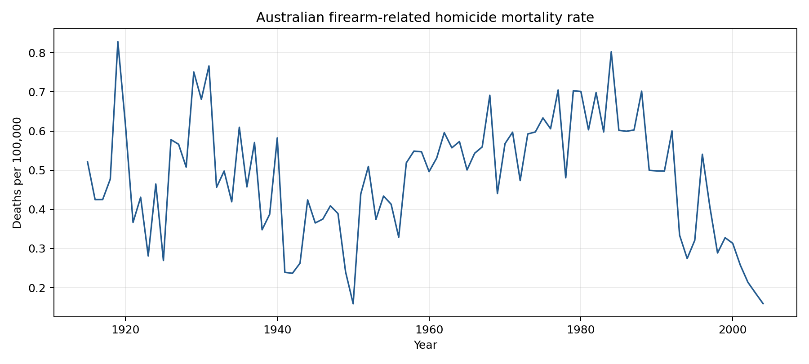
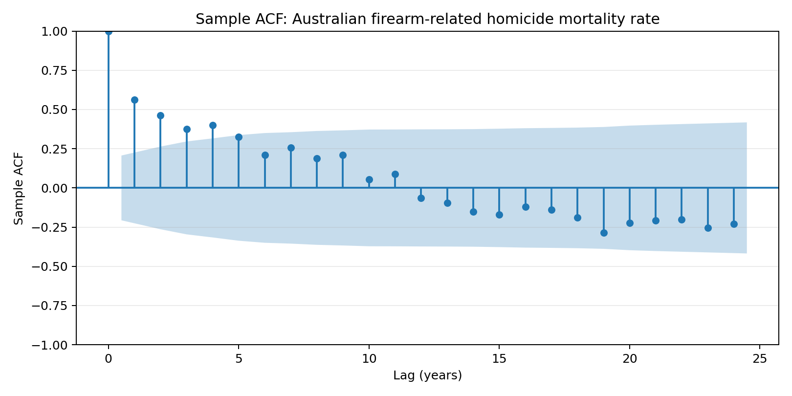
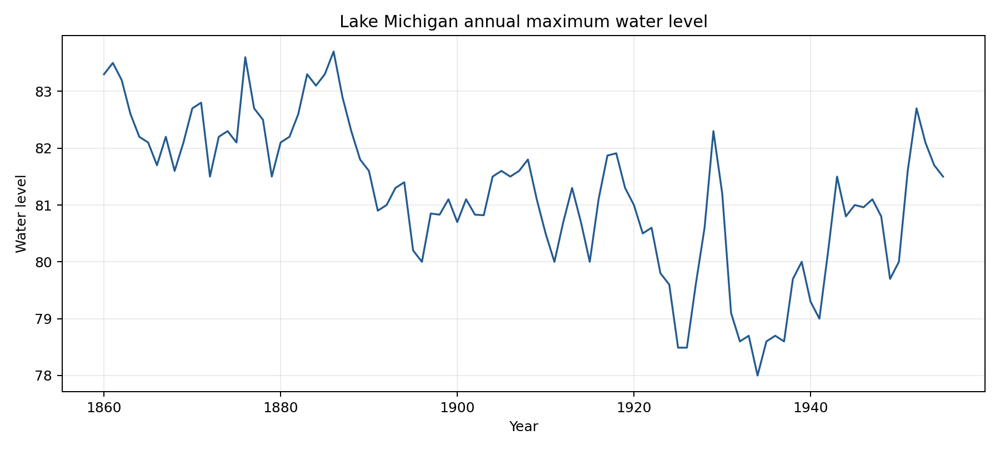
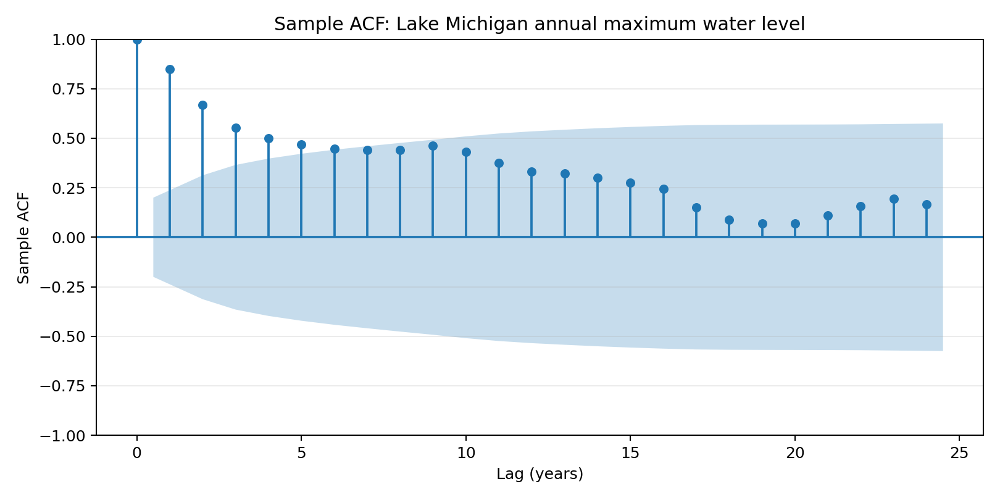
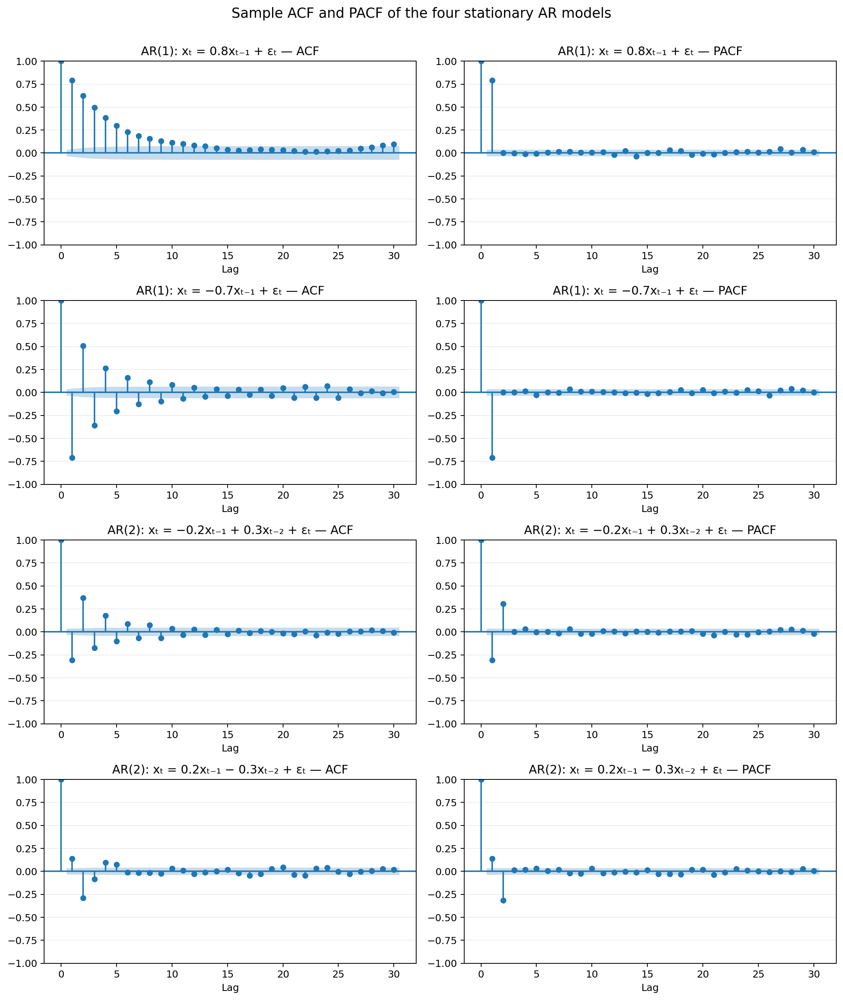

# 实验二：平稳性、纯随机性与 AR 模型

从仓库根目录执行 `python exp2/analysis.py`，程序读取本目录下的 `E2_7.xlsx`、`E2_8.xlsx`，并在 `exp2/figures/` 生成时序图、自相关图以及四种 AR 模型的 ACF/PACF 对照图。依赖见本目录的 `requirements.txt`。

## 1. 澳大利亚枪支相关凶杀死亡率（1915–2004）

序列的全期均值约为 0.484（每 10 万人）。时序图呈现数十年尺度的起伏，后段明显下降，因此均值是否稳定并不确定；ACF 前 5 阶显著，之后大多落在置信区间内。ADF 检验 p=0.551，未拒绝单位根原假设；KPSS 检验 p>0.10，未拒绝平稳原假设。结合有限样本和图形，不能据此断言严格平稳。

作为题目所要求的条件性分析，若近似按平稳序列处理，对其进行 10 阶 Ljung–Box 检验得 Q=107.637，p=1.60×10⁻¹⁸。在 5% 水平下拒绝“前 10 阶自相关均为零”的原假设；在该平稳性假设下，该序列不是纯随机序列。由于均值稳定性存疑，此结论应谨慎解释。

## 2. 密歇根湖年度最高水位（1860–1955）

水位总体从前期较高水平降至后期较低水平，期间伴随多年周期起伏；ACF 长时间保持较高正相关并缓慢衰减。ADF 检验 p=0.069，在 5% 水平下未拒绝单位根原假设；KPSS 检验 p=0.010，拒绝水平平稳原假设。结合时序图，按非平稳序列处理。题目所述纯随机性检验以平稳序列为前提，因此不据该序列的原始水平序列作白噪声结论。

## 3. 四个平稳 AR 模型

按题目公式分别模拟四个模型并绘制样本 ACF、PACF。对 AR(1)，PACF 主要在 1 阶后截尾，ACF 拖尾；对 AR(2)，PACF 主要在 2 阶后截尾，ACF 拖尾。图中样本相关系数会因有限样本略有波动。模拟采用固定随机种子，便于复现。

