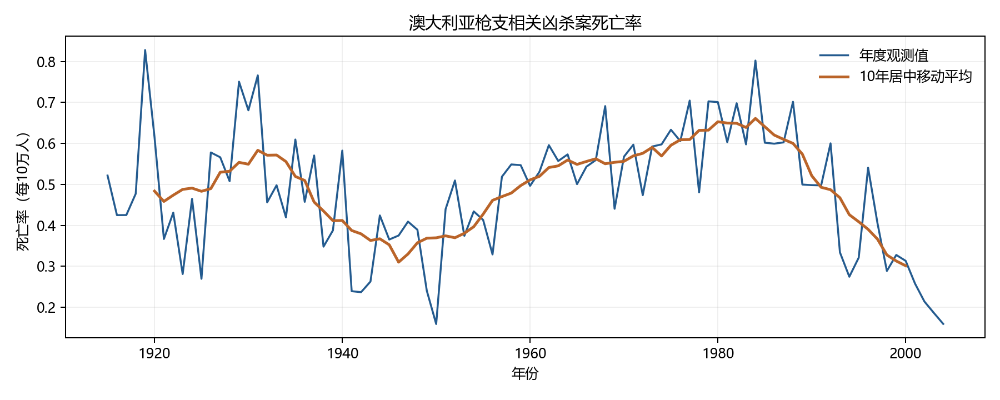
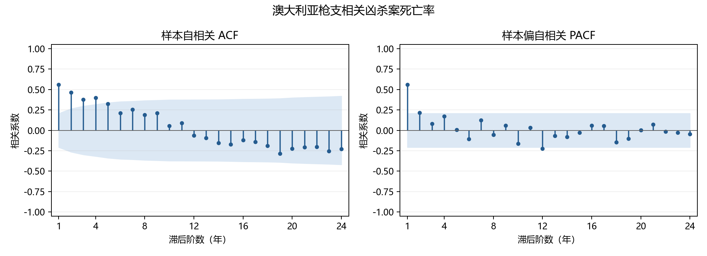
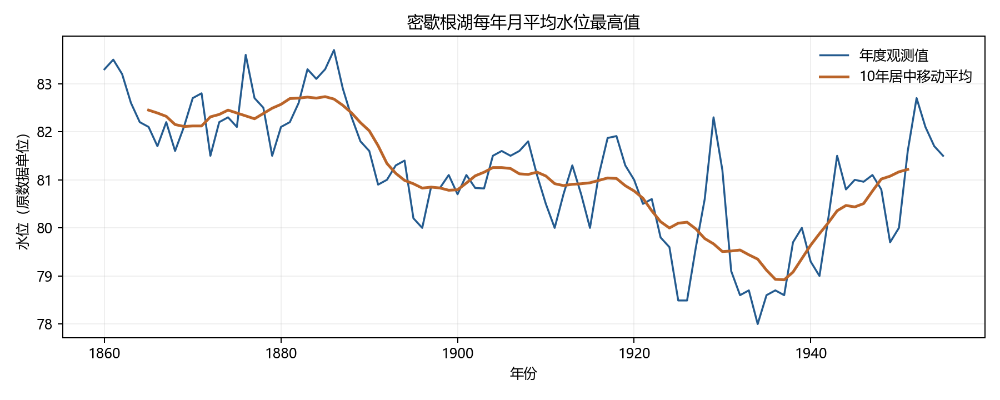
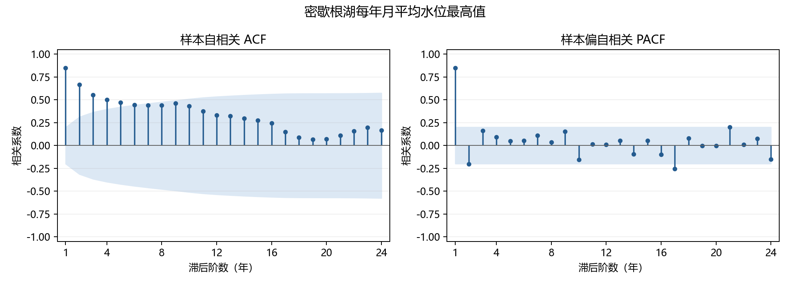
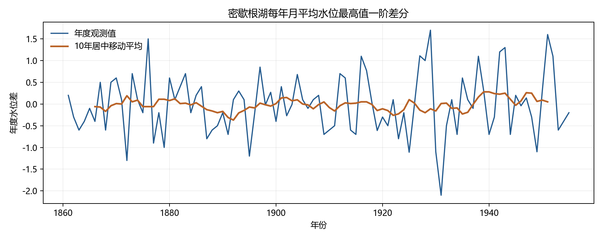
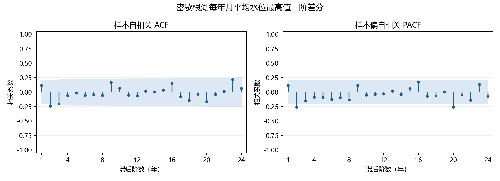

# 实验三：平稳性与 ACF/PACF 的截尾、拖尾特征

依据本地题目，分别分析 1915–2004 年澳大利亚枪支相关凶杀案死亡率与 1860–1955 年密歇根湖每年月平均水位的最高值。后者是每年一个观测值，不是月度序列；原表未注明水位单位，因此保留原数据单位。

## 运行

在仓库根目录的 Anaconda Prompt 或已激活 Anaconda 的终端执行：

```powershell
conda activate base
python exp3/analysis.py
```

本机已有依赖，无需配置新环境。其他机器若缺包，优先在已有 Anaconda 环境中使用南京大学镜像：

```powershell
python -m pip install -r exp3/requirements.txt -i https://mirror.nju.edu.cn/pypi/web/simple
```

代码路径基于脚本目录，因此也可在 `exp3/` 内运行 `python analysis.py`。分析沿用实验二的 pandas、Matplotlib 和 statsmodels 方法，补充 PACF 与数值结果；不依赖 `exp2/` 文件。

## 方法与判读

原始数据位于 `doc/E2_7.xlsx`、`doc/E2_8.xlsx`，分别有 90 和 96 条连续年度记录，无缺失值。时序图同时显示原始观测与10年居中移动平均，用于观察局部均值变化；移动平均不参与检验。样本 ACF/PACF 展示1–24阶；ACF 使用分母 n 的样本自协方差与 Bartlett 95%逐阶参考区间，PACF 使用不作样本量修正的 Yule–Walker 估计（`ywm`），参考区间约为 ±1.96/√n。

ADF 原假设为存在单位根，采用常数项、AIC 选滞后阶数；KPSS 原假设为水平平稳，采用常数项、自动带宽。显著性水平为5%。KPSS 查表范围为0.01–0.10，边界结果以不等号表示。未拒绝原假设不能等同于证明原假设成立。

理论上，平稳 AR(p) 的 ACF 拖尾、PACF 在 p 阶后截尾；平稳 MA(q) 的 ACF 在 q 阶后截尾、PACF 拖尾。样本图只能判断近似形态，逐阶95%区间不作多重比较校正，零星越界不能单独否定近似截尾。对非平稳原序列，区间仅作图形参考，不能直接使用上述规则确定模型阶数。

## 检验结果

| 序列 | n | 均值 | 样本标准差 | ADF统计量 | ADF p值 | KPSS统计量 | KPSS p值 |
| --- | ---: | ---: | ---: | ---: | ---: | ---: | ---: |
| 澳大利亚死亡率 | 90 | 0.4840 | 0.1519 | -1.4638 | 0.5513 | 0.1496 | >0.10 |
| 密歇根湖水位 | 96 | 81.1766 | 1.3224 | -2.7307 | 0.0689 | 1.0214 | <0.01 |
| 水位一阶差分 | 95 | -0.0189 | 0.6926 | -8.2359 | 5.89e-13 | 0.0956 | >0.10 |

### 1 澳大利亚死亡率

时序图表现为多年尺度的起伏，后段明显下降，没有稳定的全期线性趋势；均值稳定性仍存疑。ADF 未拒绝单位根原假设，KPSS 未拒绝水平平稳原假设，两者没有给出一致证据。课堂图形分析可将其作为近似平稳的有相关性序列讨论，但不能据此确认平稳，更不能确认严格平稳。



ACF 随滞后增加总体衰减，并由正相关逐渐转为弱负相关，呈拖尾形态。PACF 前两阶较突出，第二阶仅略超出95%参考区间，第三阶以后大多接近零；第12阶存在孤立越界。因此可描述为近似二阶截尾，但二阶判断较弱，不宜直接确定 AR(2) 模型。



PACF 第1、2、3阶分别为 0.5608、0.2152、0.0800；95%参考半宽约 0.2066。第12阶为 -0.2222。ACF 第1、5、10阶为 0.5608、0.3239、0.0540，ACF进入区间不代表理论上变为零。

### 2 密歇根湖水位

时序图前期水位较高、后期较低，并伴随多年起伏，均值随时间改变。ACF 长时间保持较高正相关并缓慢衰减。ADF 在5%水平下未拒绝单位根原假设，KPSS 拒绝水平平稳原假设；综合判断原序列按非平稳序列处理。



ACF 缓慢衰减，呈明显拖尾形态。PACF 第一阶很大，第二阶负相关仅略超出95%参考区间，之后大多较小，第17、21阶有孤立越界。图形上可近似描述为二阶截尾（第二阶在临界附近），但原序列非平稳，不能据此套用平稳 AR(2) 的识别规则。



ACF 第1、5、10、16阶分别为 0.8503、0.4691、0.4326、0.2439。PACF 第1、2、3阶分别为 0.8503、-0.2030、0.1612；95%参考半宽约 0.2000。

### 补充 一阶差分验证

一阶差分 Δx_t = x_t − x_(t−1) 后，序列围绕接近零的均值波动，ADF 拒绝单位根原假设，KPSS 未拒绝水平平稳原假设，支持差分序列近似平稳。这是补充验证，并不证明原序列一定含单位根；本实验不进一步拟合或确定 ARIMA 阶数。





差分后的 ACF/PACF 不再呈原序列那样的长期高正相关，低阶仍有相关性；有限样本下高阶有零星越界，不能据此认定精确截尾阶数。

## 文件说明

- `analysis.py`：生成全部分析图表、CSV、JSON 与本说明。
- `requirements.txt`：本实验依赖；`results/results.json` 记录实际运行版本和检验设置。
- `figures/`：6张分析图；`results/diagnostics.csv`：描述统计与平稳性检验；`results/*_correlations.csv`：各阶 ACF/PACF、区间与越界标记（0阶不参与特征判读）。
- `build_report.py`：根据计算结果生成本地 Word 报告，运行 `python exp3/build_report.py`；输出到 `report/`。
- 题目及 Word/PDF 报告仅保留本地，遵守项目隐私要求。数据表上传前仅清除作者等个人元数据，观测值保持不变。

## 方法参考

statsmodels 官方文档：[ACF](https://www.statsmodels.org/stable/generated/statsmodels.tsa.stattools.acf.html)、[PACF](https://www.statsmodels.org/stable/generated/statsmodels.tsa.stattools.pacf.html)、[ADF](https://www.statsmodels.org/stable/generated/statsmodels.tsa.stattools.adfuller.html)、[KPSS](https://www.statsmodels.org/stable/generated/statsmodels.tsa.stattools.kpss.html)。
